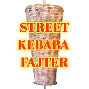

# Street Kebab Fighter

> *A 2D fighting game about settling disputes the old-fashioned way with your favorite characters from "Čaršija"*

<p align="center">
  
</p>

<p align="center">
  
  
  
</p>

> [!WARNING]
> The game is still in development.

## Features
- *1 playable character* 
- *1 playable stage* 

---

## Controls

| Action | Player 1 | Player 2 |
|---|---|---|
| Jump | **W** | **UP** |
| Move Forward, Backward  | **A, D** | **LEFT, RIGHT** |
| Crouch | **S** | **DOWN** |
| Light Attack | **F** | **I** |
| Medium Attack | **G** | **O** |
| Heavy Attack | **H** | **P** |
| Block | Backward + Light Attack |  Backward + Light Attack |

## Platform Support

| Platform | Status |
|---|---|
| Windows | ✅ Supported |
| Linux | 🔜 Coming soon |

## Dependencies

| Dependency | Version |
|---|---|
| SDL2 | *2.32.6* |
| SDL2_image | *2.8.2* |

## Build

The game can be built using a "nob.h" (Tscoding: [Github](https://github.com/tsoding)) script, but it only supports **gcc** or **clang** compilers. 

After installing the repo the game is built in 2 steps:
1. Compiling the script once 
2. Running nob to build the game

If you want to know why would you even compile the script for building just to, build again, go look at repository of [nob.h](https://github.com/tsoding/nob.h).

### Windows

1. Open *Cmd* or *PowerShell* and check if you are in the root folder of the repo (something like: ...\path\to\Street-Kebab-Fighter or).
Run this command to compile the script: 
```
gcc -o nob.exe nob.c
```

2. Then run the nob script with:

```
.\nob -run
```

### Build options

Scrpit has a few flags like:
- "-run" - Runs the game after compilation 
- "-static" - Links the game statically instead of dynamically
- "-dbg" - Compile with debug info

By default gcc is used but you can replace it with clang if you want.

## Roadmap

- [x] *Collision and attacking systems*
- [x] *Build script with "nob.h"*
- [ ] *Asset baking* - Allow compiling all assets directly into the game binary instead of loading them at runtime  
- [ ] *Linux support*

---

## Credits

- ✏️ *Art — LomimStaklo*
- ✏️ *Jojo's Bizarre Adventure Regular — Patrick H. Lauke*

---

## License

This project is licensed under the MIT License — see [LICENSE](LICENSE) for details.
